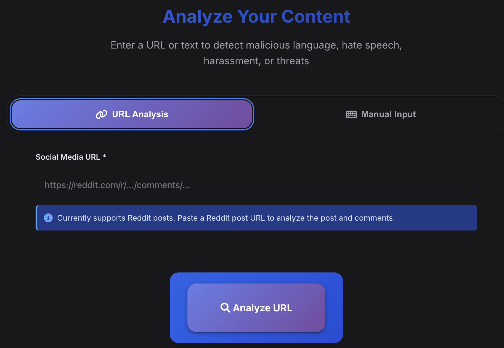
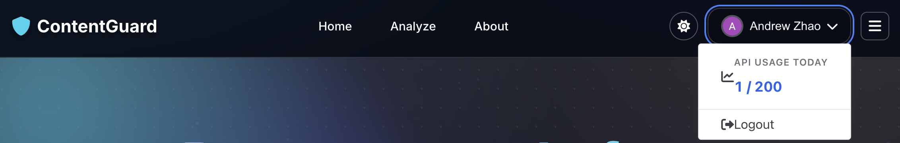

# ContentGuard AI

> AI-powered content moderation that understands Gen Z

Detect harmful content, hate speech, harassment, and threats in real-time. Built for modern teenage communities with support for slang, internet language, and evolving online behaviors.

[](LICENSE)
[](https://plankton-app-xj6ib.ondigitalocean.app)

---

## 🚀 Try It Now

**Live Demo:** [https://plankton-app-xj6ib.ondigitalocean.app](https://plankton-app-xj6ib.ondigitalocean.app)





---

## Quick Start

### Option 1: Web Interface

1. Visit [https://plankton-app-xj6ib.ondigitalocean.app](https://plankton-app-xj6ib.ondigitalocean.app)
2. Enter text to analyze (title + content)
3. Click **"Analyze Content"**
4. View risk assessment and detailed breakdown

### Option 2: API Integration

#### Python
```python
import requests

response = requests.post(
    "https://plankton-app-xj6ib.ondigitalocean.app/analyze",
    json={
        "title": "Post Title",
        "content": "Text to analyze",
        "model": "gemini"  # or "huggingface"
    }
)

result = response.json()
print(f"Model: {result['model_type']}")
print(f"Is Malicious: {result['is_malicious']}")
print(f"Confidence: {result['confidence']}")
```

#### JavaScript
```javascript
const response = await fetch('https://plankton-app-xj6ib.ondigitalocean.app/analyze', {
  method: 'POST',
  headers: { 'Content-Type': 'application/json' },
  body: JSON.stringify({
    title: 'Post Title',
    content: 'Text to analyze',
    model: 'gemini'  // or 'huggingface'
  })
});

const result = await response.json();
console.log(`Model: ${result.model_type}`);
console.log(`Is Malicious: ${result.is_malicious}`);
```

#### cURL
```bash
curl -X POST https://plankton-app-xj6ib.ondigitalocean.app/analyze \
  -H "Content-Type: application/json" \
  -d '{
    "title": "Post Title",
    "content": "Text to analyze",
    "model": "gemini"
  }'
```

---

## 🔐 Authentication

### Sign In with OAuth

ContentGuard supports OAuth login via **Google** and **GitHub**:

1. **Visit the app** → Click "Sign In"
2. **Choose provider** → Google or GitHub
3. **Authorize** → Grant permissions
4. **Start analyzing** → Access enhanced features

### Why Sign In?

| Feature | Anonymous | Registered |
|---------|-----------|------------|
| Content Analysis | ✅ | ✅ |
| Rate Limit | Limited | Higher |
| Usage Tracking | ❌ | ✅ |
| API Access | ❌ | ✅ |

---

## 🤖 AI Model Selection

ContentGuard now supports **two AI models** for content analysis:

### 1. Gemini 2.5 Flash (Finetuned) - **Default**
- **Enhanced accuracy** with Google's latest AI
- **Specialized for Gen Z language** through custom finetuning
- **Rate Limit**: 10 requests/day per user, 40 total/day globally
- **Best for**: Critical content moderation requiring highest accuracy

### 2. ContentGuard Model (Free)
- **Unlimited usage** for registered users (200/day)
- **Fast processing** with consistent results
- **Rate Limit**: 100/day anonymous, 200/day registered
- **Best for**: High-volume content screening

### How to Choose

Specify the model in your API request:

```json
{
  "title": "Post Title",
  "content": "Text to analyze",
  "model": "gemini"  // or "huggingface"
}
```

**Web Interface**: Select your preferred model from the dropdown before analyzing.

---

## 📡 API Reference

### Endpoint

```
POST https://plankton-app-xj6ib.ondigitalocean.app/analyze
```

### Request Format

```json
{
  "title": "string (optional)",
  "content": "string (required)",
  "model": "gemini | huggingface (optional, default: gemini)"
}
```

### Response Format

```json
{
  "analysis": "SAFE | MALICIOUS",
  "confidence": "92.5%",
  "is_malicious": false,
  "risk_level": "LOW | MEDIUM | HIGH",
  "explanation": "Detailed analysis explanation",
  "keyword_analysis": {
    "malicious_keywords": ["keyword1", "keyword2"],
    "safe_keywords": ["keyword3", "keyword4"]
  }
}
```

### Example Responses

#### Safe Content
```json
{
  "analysis": "SAFE",
  "confidence": "94.2%",
  "is_malicious": false,
  "risk_level": "LOW",
  "explanation": "Content appears safe with positive language patterns.",
  "keyword_analysis": {
    "malicious_keywords": [],
    "safe_keywords": ["support", "help", "community"]
  }
}
```

#### Harmful Content
```json
{
  "analysis": "MALICIOUS",
  "confidence": "87.8%",
  "is_malicious": true,
  "risk_level": "HIGH",
  "explanation": "Content contains harassment and threatening language.",
  "keyword_analysis": {
    "malicious_keywords": ["threat", "harass"],
    "safe_keywords": []
  }
}
```

### Rate Limits

#### Gemini 2.5 Flash Model
- **Per User**: 10 requests/day (authenticated users only)
- **Global**: 40 requests/day across all users
- **Reset**: Daily at midnight UTC

#### ContentGuard Model (Free)
- **Anonymous Users**: 100 requests/day per IP
- **Registered Users**: 200 requests/day
- **Reset**: Daily at midnight UTC

---

## ✨ Features

### 🎯 Detection Categories
- Suicide & self-harm language
- Hate speech & slurs
- Harassment & bullying
- Threats & violence
- Body shaming
- Scams & manipulation
- Sexual content
- Spam patterns
- And more...

### 🔍 Analysis Capabilities
- **Real-time processing** - Results in milliseconds
- **Multi-language support** - English + internet slang
- **Context awareness** - Understands intent vs casual usage
- **Confidence scoring** - Probability-based risk levels
- **Keyword extraction** - Identifies specific harmful terms
- **Emoji processing** - Handles modern communication

### 📊 Reporting
- Clear risk level classification (HIGH/MEDIUM/LOW)
- Specific keyword breakdowns
- Actionable recommendations
- Visual indicators for quick scanning

---

## 💡 Use Cases

**Social Media Platforms**
Automatically moderate user posts and comments at scale

**Online Communities**
Protect members from harassment before it spreads

**Educational Platforms**
Maintain safe learning environments for students

**Gaming Communities**
Detect toxic behavior in chat and forums

**Customer Support**
Flag harmful messages for human review

---

## ❓ FAQ

**Q: How accurate is the detection?**
A: Our model provides confidence scores with each analysis. Typical confidence ranges from 85-95% for clear cases.

**Q: Does it support languages other than English?**
A: Currently optimized for English and internet slang. Multi-language support coming soon.

**Q: Can I customize the detection categories?**
A: The current version uses pre-trained categories. Custom models available for enterprise users.

**Q: Is my data stored or logged?**
A: We do not store analyzed content. Only usage metrics are tracked for registered users.

**Q: What happens if content is flagged?**
A: The API returns risk assessment data. Your application decides what action to take (flag, review, remove, etc.).

**Q: Can I test it without signing up?**
A: Yes! Use the web interface or API with limited rate limits as an anonymous user.

---

## 🛠️ Support

**Report Bugs**
Visit our [Bug Report Page](https://plankton-app-xj6ib.ondigitalocean.app/bug-report)

**Feature Requests**
[Open an issue](https://github.com/Ayingxizhao/GENZ-ContentGuard-AI/issues)

**Questions**
Check the FAQ above or create an issue on GitHub

---

## 📝 License

MIT License - see [LICENSE](LICENSE) for details

---

<p align="center">Built with ❤️ for safer online communities</p>
